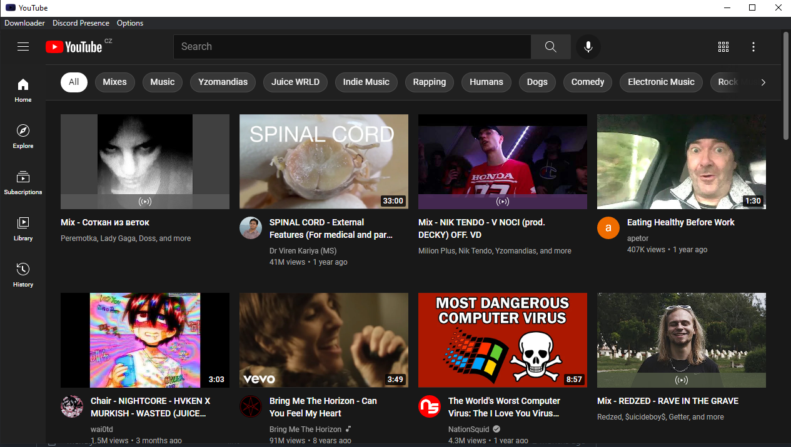

# YouTube [Windows Only]


*Please note that this application is still in development and some features may be buggy.*

**Some parts of the code have been used from *th-ch's* [**YouTube Music**](https://github.com/th-ch/youtube-music) repository.**

**YouTube application made in [Electron](https://www.electronjs.org/) with:**
- Additional plugins such as Discord RPC, Disable Log In button, Downloader etc.



## How to Download?

Download is not available yet, but if you want it so much, check the *Dev* section.

### Operating Systems

This application can be used only on Windows, maybe on different Operating Systems, but it can be buggy and some functions mustn't work.

## Available Plugins:
- **Ad Blocker [Buggy]**: removes all ads from YouTube so you can watch without any disturbing ads
- **Disable Google Log In**: removes "Log In" buttons from YouTube
- [**Discord Rich Presence**](https://discord.com): sets rich presence to your Discord account, your friends will be able to see what are you watching at the moment [playing](https://raw.githubusercontent.com/honzaxdddddd/YouTube/main/screenshots/playing.png) [paused](https://raw.githubusercontent.com/honzaxdddddd/YouTube/main/screenshots/paused.png) [searching](https://raw.githubusercontent.com/honzaxdddddd/YouTube/main/screenshots/searching.png)
- **Downloader**: download any video from YouTube in .mp3 or .mp4 simply by clicking on *Downloader* section in main menu
- **Taskbar Controls**: shows taskbar controls when you move cursor to YouTube app [Screenshot](https://raw.githubusercontent.com/honzaxdddddd/YouTube/main/screenshots/taskbarcontrols.png)

## Dev

# Requirements:
- Node.js
- Visual Studio Build Tools [otherwise Electron will not be installed]

Clone this repository, after that, run terminal from that folder and do this:
```sh
yarn
electron .
```
